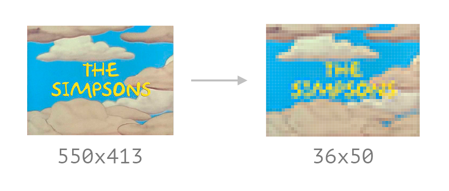
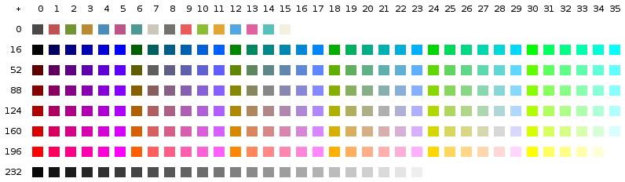
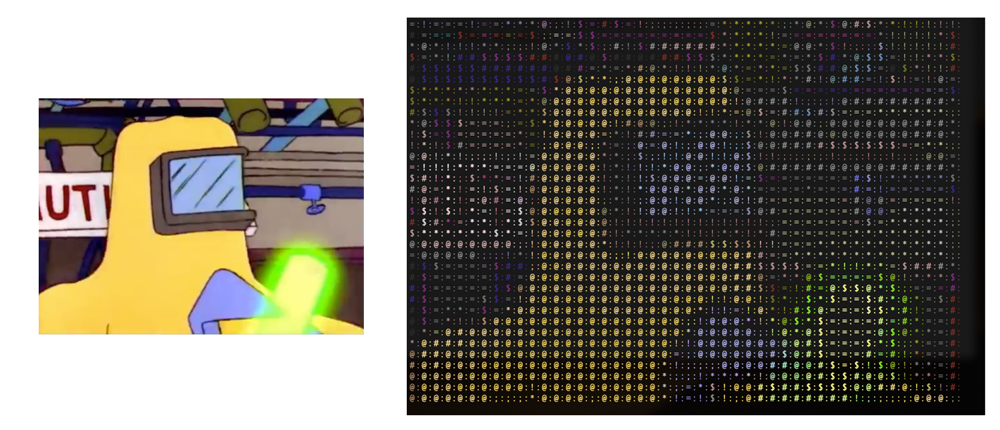

<div align=center>

  

<p>

  It's a simple python package to play videos in a terminal using [ASCII](https://en.wikipedia.org/wiki/ASCII) characters.

</p>


</div>

<details><summary><b>Translations</b></summary>
<p>

- [🇺🇸 English](./README.md)
- [🇪🇸 Español](./translations/README_es.md)
- [🇹🇼 繁體中文](./translations/README_zh-TW.md)

<p>
</details>

## Requirements

- Python3
- PortAudio (_Only required for installation with audio support_)
- FFmpeg (_Only required for installation with audio support_)
- Linux or MacOS ... by now

## Installation

Standard installation

```bash
$ pip3 install video-to-ascii
```

With audio support installation

```bash
$ pip3 install video-to-ascii --install-option="--with-audio"
```

## How to use

Just run `video-to-ascii` in your terminal

```bash
$ video-to-ascii -f myvideo.mp4
```

### Options

**`--strategy`**
Allow to choose a strategy to render the output.


**`-o --output`**
Export the rendering output to a bash file to share with someone.


**`-a --with-audio`**
If an installation with audio support was made, you can use this option to play the audio track while rendering the video ascii characters.

## How it works

Every video is composed by a set of frames that are played at a certain frame rate.


Since a terminal has a specific number of rows and columns, we have to resize our video to adjust to the terminal size limitations.


To reach a correct visualization of an entire frame we need to adjust the _frame height_ to match the _terminal rows_, avoiding using more _characters_ than the number of _terminal columns_.



When picking a character to represent a pixel we need to measure the relevance of that pixel's color in the frame, based on that we can then select the most appropriate character based on the [relative luminance](https://en.wikipedia.org/wiki/Relative_luminance) in colorimetric spaces, using a simplified version of the luminosity function.

<p align="center">
  
</p>

> Green light contributes the most to the intensity perceived by humans, and blue light the least.

This function returns an integer in the range from 0 to 255, we assign a character according to density to show more colored surface for areas with more intense color (highest values).

```python
CHARS_LIGHT 	= [' ', ' ', '.', ':', '!', '+', '*', 'e', '$', '@', '8']
CHARS_COLOR 	= ['.', '*', 'e', 's', '@']
CHARS_FILLED    = ['░', '▒', '▓', '█']
```

The reduced range of colors supported by the terminal is a problem we need to account for. Modern terminals support up to 256 colors, so we need to find the closest 8 bit color that matches the original pixel in 16 or 24 bit color, we call this set of 256 colors [ANSI colors](https://stackoverflow.com/questions/4842424/list-of-ansi-color-escape-sequences).




Finally, when putting it all together, we will have an appropriate character for each pixel and a new color.



## As Seen On
<a href="https://www.producthunt.com/posts/video-to-ascii" target="_blank" rel="noopener"></a>
