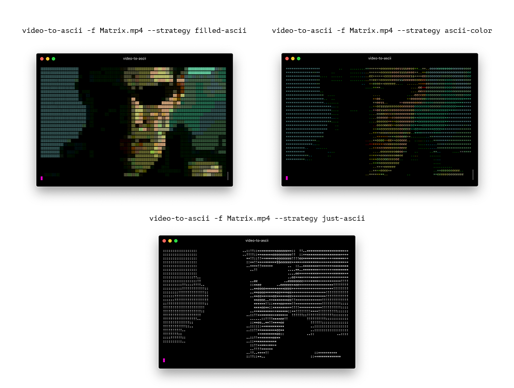

<div align=center>

  

<p>

  一款用來在終端機中使用 [ASCII](https://en.wikipedia.org/wiki/ASCII) 字元播放影片的 Python 套件。

  [](https://opencollective.com/video-to-ascii) [](https://badge.fury.io/py/video-to-ascii)
  [](https://codeclimate.com/github/joelibaceta/video-to-terminal/maintainability)
  [](https://github.com/joelibaceta/video-to-ascii)
  [](http://hits.dwyl.io/joelibaceta/https://github.com/joelibaceta/video-to-ascii)

</p>


</div>

<details><summary><b>文件翻譯</b></summary>
<p>

- [🇺🇸 English](../README.md)
- [🇪🇸 Español](./README_es.md)
- [🇹🇼 繁體中文](./README_zh-TW.md)

<p>
</details>

## 使用需求

- Python3
- PortAudio (_僅用來提供音訊功能的安裝支持_)
- FFmpeg (_僅用來提供音訊功能的安裝支持_)

## 安裝方式

標準安裝：

```bash
$ pip3 install video-to-ascii
```

安裝時添加音訊功能：

```bash
$ pip3 install video-to-ascii --install-option="--with-audio"
```

## 使用指南

只需要在你的終端機中執行 `video-to-ascii` 命令：

```bash
$ video-to-ascii -f myvideo.mp4
```

### 選項

**`--strategy`**

允許選擇影片輸出時的渲染策略。



**`-o --output`** 匯出影片渲染後的輸出結果為腳本檔案，用以分享給他人使用。


**`-a --with-audio`**

如果安裝時帶有音訊功能，你可以使用這個選項來在透過 ASCII 字元渲染影片時播放音訊。

## 如何運作

任何的影片皆由一系列的影格（或稱為幀，frames）所組成，並透過特定的幀率（frame rate）進行播放。


由於終端機有特定的行數與列數，我們必須調整影片大小來適配終端機的大小限制。


為了使每一個完整影格能夠正確地被視覺化，我們必須調整 _影格高度（frame height）_ 來適配 _終端行數（terminal rows）_，並避免使用超出 _終端列數（terminal columns）_ 的 _字元（characters）_。


在選擇一個字元（character）來表示一個像素（pixel）時，我們需要測量該像素顏色在影格中的相關性，並使用簡化版本的光度函數（luminosity function）來根據色度空間中的 [相對發光亮度（relative luminance）](https://en.wikipedia.org/wiki/Relative_luminance) 選擇最適當的字元。

<p align="center">
  
</p>

> 綠光對於人體的視覺強度感知最高，而藍光最少。

這個函數會返回一個介於 0 到 255 之間的整數，我們根據密度分配字元，用以在色彩感知度較高（較高的數值）的區塊顯示較大的塗色區塊。
顯示顏色較深區域的

```python
CHARS_LIGHT 	= [' ', ' ', '.', ':', '!', '+', '*', 'e', '$', '@', '8']
CHARS_COLOR 	= ['.', '*', 'e', 's', '@']
CHARS_FILLED    = ['░', '▒', '▓', '█']
```

終端機所能支援的色彩範圍是我們需要解決的問題。現代的終端機最多支援 256 色，因此我們需要找到與原來像素的 16 位元顏色或 24 位元顏色最接近的 8 位元顏色，我們稱這 256 個顏色為 [ANSI 色](https://stackoverflow.com/questions/4842424/list-of-ansi-color-escape-sequences)。


最後，我們便可以得到對於每個像素而言最適當的字元與色彩。


## 貢獻者

### 程式貢獻者

這個項目的存在要感謝所有貢獻者。[[Contribute](../CONTRIBUTING.md)].

<a href="https://github.com/joelibaceta/video-to-ascii/graphs/contributors"></a>

### 財務貢獻者

成為財務貢獻者，並幫助我們維持我們的社群。[[Contribute](https://opencollective.com/video-to-ascii/contribute/)].

或者是 [贊助我一杯咖啡](https://ko-fi.com/joelibaceta)。

#### 個人贊助

<a href="https://opencollective.com/video-to-ascii#backers" target="_blank" rel="noopener"></a>

#### 機構贊助

與您的組織一起支持此項目。您的組織徽章將顯示在此處，並帶有指向您網站的鏈接。[[Contribute](https://opencollective.com/video-to-ascii/contribute)]

<a href="https://opencollective.com/video-to-ascii/organization/0/website" target="_blank" rel="noopener"></a>
<a href="https://opencollective.com/video-to-ascii/organization/1/website" target="_blank" rel="noopener"></a>
<a href="https://opencollective.com/video-to-ascii/organization/2/website" target="_blank" rel="noopener"></a>
<a href="https://opencollective.com/video-to-ascii/organization/3/website" target="_blank" rel="noopener"></a>
<a href="https://opencollective.com/video-to-ascii/organization/4/website" target="_blank" rel="noopener"></a>
<a href="https://opencollective.com/video-to-ascii/organization/5/website" target="_blank" rel="noopener"></a>
<a href="https://opencollective.com/video-to-ascii/organization/6/website" target="_blank" rel="noopener"></a>
<a href="https://opencollective.com/video-to-ascii/organization/7/website" target="_blank" rel="noopener"></a>
<a href="https://opencollective.com/video-to-ascii/organization/8/website" target="_blank" rel="noopener"></a>
<a href="https://opencollective.com/video-to-ascii/organization/9/website" target="_blank" rel="noopener"></a>
